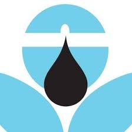
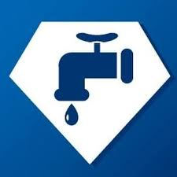

    

    

	
	

## ♑ About me

- Ingeniero Civil de la Universidad Nacional de Huancavelica. Interesado en el desarrollo de soluciones computacionales para hidrología, hidráulica, modelamiento hidráulico, GIS, teledetección, meteorología entre otros integrando herramientas de software libre
- Trabajo con programación estructurada y funcional para optimizar procesos de análisis, modelamiento y gestión de información en proyectos de ingeniería, incluyendo expedientes técnicos y obras de infraestructura hidráulica, vial y de edificación.
- Actualmente exploro lenguajes de programación para computación científica y estudio los fundamentos de aprendizaje automático y aprendizaje profundo, con interés en su aplicación a problemas hidrológicos, análisis de datos espaciales y automatización de flujos de trabajo.
 

## 🛠️ Tools

 <kbd>
      <kbd>Operating Sytem</kbd>
       
       
        
        
    </kbd>
       
    <kbd>
      <kbd>Programming and Markup Languages</kbd>
       
       
        
        
		
		
		
		
		
        
    </kbd>
       
    <kbd>
      <kbd>Data Science & AI</kbd>
       
       
      
      
      
      
      
      
      
    </kbd>
    <kbd>
      <kbd>GIS & Teledetección</kbd>
       
       
		<a href="https://qgis.org/" target="_blank"></a>
		<a href="https://www.esri.com/en-us/arcgis/products/arcgis-pro/overview" target="_blank">
			</a>
		<a href="https://www.saga-gis.org/" target="_blank">
			</a>
		<a href="https://earthengine.google.com/" target="_blank">
			</a>
		<a href="https://www.agisoft.com/" target="_blank">
			</a>
    </kbd>
    <kbd>
      <kbd>CAD</kbd>
       
       
	  <a href="https://www.autodesk.com/products/civil-3d/overview" target="_blank">
			</a>
      
	  
    </kbd>
       
    <kbd>
      <kbd>Estructuras</kbd>
       
       
      
	  
	  
    </kbd>
    <kbd>
      <kbd>Hidrología e Hidráulica</kbd>
       
       
        
        
		
		
		
		
		
		
		
		
		
		<a href="https://www.flo-2d.com/" target="_blank">
			</a>
    </kbd>
    <kbd>
      <kbd>Code Editors & Notebooks</kbd>
       
       
      
      
      
      </kbd>

 

## 📈 Github Profile Stats

    

 

## 🏆 Github Profile Trophy

    

## 📬 Contact me

    
    
    
    

---

Last edited on: 28/08/2023
